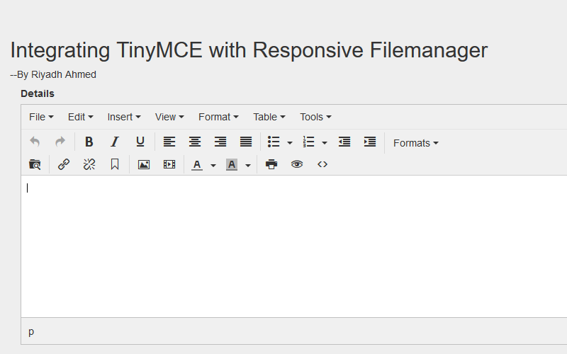
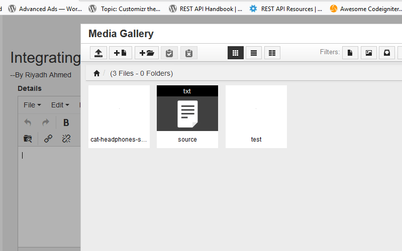

<h1>Simple Code for integrating TinyMCE with Responsive Filemanager </h1> \ 
You can use this code into codeigniter as well \ 
local server must be installed in your system. i used xampp \

To integrate TinyMCE with Responsive Filemanager we can follow some steps

Download this projects to view demo

Steps 

1. Copy and paste tinymce folder and filemanager folder into your root folder
2. In your web page where you view the TinyMCE editor add a textarea field like below code

            

                <label for = "BlogDetails"> Blog Details </label>
                <textarea id = "BlogDetails" name = "blog_details" placeholder = "Write Here"></textarea>
            

3. Add below script code into your web page

            

4. Edit config.php file located at  filemanager/config folder.
5. Change the url of source and thumbs folder where files will be uploaded. 	
6. In config.php file you can also control file_number_limit_js, MaxSizeUpload, image_resizing and many more

Output : 

 Find me on Facebook  : [ My Facebook profile link](https://www.facebook.com/morshed.riyad) \
 Find me on  Linkedin  : [My Linkedin profile  link](https://www.linkedin.com/in/monjur-morshed-riyadh-6aaba465/)